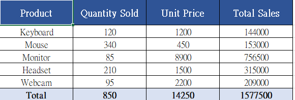

# Excel Automation Tools

A collection of Python scripts for common Excel automation tasks.  
Built with `pandas` and `openpyxl` — no Excel installation required.

---

## Tools

| # | Tool | Description |
|---|------|-------------|
| 01 | [merge_sheets](01_merge_sheets/) | Merge multiple Excel files or sheets into one |
| 02 | [auto_report](02_auto_report/) | Generate formatted reports with headers, colors, and totals |
| 03 | [filter_export](03_filter_export/) | Filter rows by conditions and export results |
| 04 | [duplicate_remover](04_duplicate_remover/) | Detect and remove duplicate rows |

---

## Requirements

```bash
pip install pandas openpyxl
```

---

## Usage

Each tool has its own folder. Navigate into the folder and run:

```bash
python create_samples.py   # generate sample input files
python <tool_name>.py      # run the tool
```

---

## 01 — Merge Sheets

Merges all `.xlsx` files in a folder into a single sheet.  
Adds source file and sheet name columns for traceability.

```python
merge_excel_files(input_folder="sample_input", output_path="merged_output.xlsx")
```

---

## 02 — Auto Report

Reads raw data and outputs a formatted Excel report with:
- Styled header row (blue background, white text)
- Auto-calculated totals row
- Uniform borders and column widths

```python
generate_report(input_path="sample_input/data.xlsx", output_path="report_output.xlsx")
```



---

## 03 — Filter Export

Filters rows by column conditions and exports the result.  
Supports `==`, `>=`, `<=`, `>`, `<`, and list matching.

```python
filters = {
    "Department": ["Engineering", "Sales"],
    "Salary": {"op": ">=", "value": 45000}
}
filter_and_export("sample_input/employee_data.xlsx", "filtered_output.xlsx", filters)
```

---

## 04 — Duplicate Remover

Detects and removes duplicate rows. Configurable by subset of columns.

```python
remove_duplicates(
    input_path="sample_input/data.xlsx",
    output_path="cleaned_output.xlsx",
    subset=None,    # None = all columns, or specify e.g. ["Name", "Department"]
    keep="first"
)
```

---

## Freelance / Custom Work

Need a custom automation script for your Excel workflow?  
Feel free to reach out: **kaisan0614@gmail.com**
